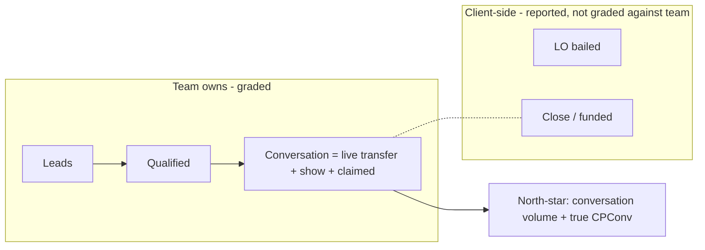

# Client Health Redesign — Design / Decision Spec

**Status:** Design only (no code). This is the build-ready spec that a later implementation plan will execute.
**Builds on:** [`docs/CLIENT-SUCCESS-AUDIT.md`](CLIENT-SUCCESS-AUDIT.md) (findings) and [`docs/council-client-success.md`](council-client-success.md) (LLM Council verdict).
**Canonical KPI definitions:** [`docs/KPIS.md`](KPIS.md).
**Date:** June 2026.

---

## 0. Why this exists

The audit found the Client Success grader is accurate in arithmetic but wrong in *judgment*: it anchors on a shows-only metric mislabeled as CPConv, penalizes clients who convert via live transfers, scores the team on a show rate that includes failures outside their control, and judges every client against one global standard regardless of market. This spec locks the corrected model.

### Decisions locked (from stakeholder review)

1. **North-star = conversations.** The team's job is to get clients on the phone with qualified leads — maximize conversation volume at an efficient cost per conversation. The team's responsibility ends at the conversation.
2. **Grade on true show rate**, not the client-facing show rate — an LO bail is not a team failure.
3. **Per-client manual benchmarks** with global defaults as fallback. Measurement math is identical for every client; only the judgment thresholds vary per client.

---

## 1. North-star and the ownership split

The funnel has a clear ownership line. The health grade for the **team** must be built only from the zone the team controls.



- **Team-owned funnel:** Leads -> Qualified -> **Conversation**. A conversation = `live_transfers + shows + claimed` (`client_conversations`, [`src/lib/metrics.ts`](../src/lib/metrics.ts) L186).
- **North-star metrics:**
  - **Conversation volume** — the primary output the team is paid to produce.
  - **True CPConv** = `ad_spend / (live_transfers + shows + claimed)` — already computed as `cp_conversation` ([`src/lib/metrics.ts`](../src/lib/metrics.ts) ~L213+). This replaces the shows-only "CPConv" the grader uses today (which is really CPS).
  - **Conversation rate** = `client_conversations / qualified_leads` — already computed as `conversation_rate` ([`src/lib/metrics.ts`](../src/lib/metrics.ts) L201). This is the fair "are we converting qualified leads?" measure that credits the live-transfer path (see also §2 on booking rate).
- **Client-side factors (report, do not grade against the team):** **Close rate** and **LO bail** depend on the client's loan officer showing up and closing. Keep them visible in the detail view as context and as *client-side* flags, but they must not pull the team's health tier down.

**Net effect:** a client that converts heavily through live transfers and has a low booking rate but strong conversation volume reads as **healthy**, because the verdict is anchored on conversations, not appointments-shown.

---

## 2. True show rate (LO-bail-fair)

The fault-adjusted metric already exists — the grader simply doesn't use it.

```198:201:src/lib/metrics.ts
    show_pct: booked > 0 ? (shows / booked) * 100 : 0,
    net_show_pct: shows + no_shows > 0 ? (shows / (shows + no_shows)) * 100 : 0,
    lo_bail_rate: booked > 0 ? (lo_bailed / booked) * 100 : 0,
    conversation_rate: qualified_leads > 0 ? (client_conversations / qualified_leads) * 100 : 0,
```

- **Grade the team on `net_show_pct`** = `shows / (shows + no_shows)`. This denominator counts only appointments where the **lead's** attendance was the deciding factor — it excludes LO bails, cancellations, and still-pending appointments. "We'd be doing great if their LO had shown up" becomes literally true in the number.
- **Keep `show_pct`** (= `shows / booked`) for **client-facing reporting only**, matching the canonical definition ([`docs/KPIS.md`](KPIS.md) L43). Do not change the client report.
- **Surface `lo_bail_rate`** as a separate **client-side** flag in the detail view, so a high LO-bail account reads as a client problem, not a team failure.
- **Implementation note (for the later build):** the grader currently scores `metrics.show_pct`:

```182:184:src/lib/client-health.ts
      metrics.show_pct,
      formatPct(metrics.show_pct),
      tierFromBands(metrics.show_pct, { critical: 51, below: 56, at: 70 }, true, 3, metrics.booked_appointments),
```

  The change is to grade `metrics.net_show_pct` instead (and recalibrate the bands, since net show rate runs higher than gross show rate). `show_pct` stays in the payload for the client report.

---

## 3. Per-client manual benchmarks (core feature)

Today every threshold is a hardcoded global constant ([`src/lib/client-health.ts`](../src/lib/client-health.ts) L161-209). That makes a high-cost-state client read "Below KPI" forever and a cheap-market client "Above KPI" forever, independent of team effort. The fix: keep the math global, make the **judgment bands** per-client, manually editable, with the current globals as the default.

### 3.1 Data model

Recommended: a dedicated table (auditable, sparse, easy to diff) rather than a JSONB blob on `clients`.

```sql
-- proposed; not yet created
create table if not exists client_kpi_benchmarks (
  id              uuid primary key default gen_random_uuid(),
  client_id       uuid not null references clients(id) on delete cascade,
  kpi_key         text not null,        -- 'lead_to_qualified' | 'net_show_rate' | 'cpconv' | ...
  critical        numeric,              -- null = inherit global default
  below           numeric,
  at_band         numeric,
  min_denominator integer,              -- optional per-client volume override
  updated_by      uuid references auth.users(id) on delete set null,
  updated_at      timestamptz default now(),
  unique (client_id, kpi_key)
);
```

- A row exists only for KPIs a human has overridden. Missing row / null column = inherit the global default. This keeps the table sparse and makes "what's been customized" obvious.
- `kpi_key` values map to the grader's existing `KpiKey` set in [`src/lib/client-health.ts`](../src/lib/client-health.ts) (extended to use `net_show_rate` and true `cpconv`).
- Alternative considered: a `kpi_benchmarks jsonb` column on `clients` ([`supabase/schema.sql`](../supabase/schema.sql) L47). Simpler migration, but no per-edit audit trail and harder to query "which clients overrode show rate." Recommend the table.

### 3.2 Grader change (spec only)

- `buildClientHealthSnapshot(events, spendRows)` ([`src/lib/client-health.ts`](../src/lib/client-health.ts) L144-237) gains an optional `benchmarks` argument: a per-client map of `kpi_key -> { critical, below, at, min_denominator }`.
- `tierFromBands(...)` calls (L161-209) read `benchmarks[kpi] ?? GLOBAL_DEFAULT[kpi]`. The current inline literals become the named `GLOBAL_DEFAULT` map (the seed/default profile).
- The API ([`src/app/api/client-health/route.ts`](../src/app/api/client-health/route.ts)) fetches `client_kpi_benchmarks` for the in-scope clients in the same round and passes each client's map into its snapshot build. No change to the event/spend fetch path.

### 3.3 Admin UI (Waiz -> Client Roster)

- Edit benchmarks in the existing Client Roster view (`admin_clients`, [`src/components/ClientRoster.tsx`](../src/components/ClientRoster.tsx)), which already patches per-client fields through a single helper:

```200:202:src/components/ClientRoster.tsx
  const onBlurField = (field: string, current: string) => (e: React.FocusEvent<HTMLInputElement>) => {
    if (e.target.value !== current) onPatch(c.id, { [field]: e.target.value });
  };
```

- Add a per-client "Benchmarks" editor (expandable row or modal) with a field per KPI band. Show the **global default as the placeholder**, and visually mark any value the user has overridden, with a "reset to default" affordance.
- Save via the existing `onPatch(c.id, ...)` -> `PATCH /api/clients/[id]` ([`src/app/api/clients/[id]/route.ts`](../src/app/api/clients/%5Bid%5D/route.ts)) pattern, extended to upsert into `client_kpi_benchmarks` (or a dedicated `PATCH /api/clients/[id]/benchmarks`).

---

## 4. Consistency principle

The single rule that keeps this honest:

> **Calculation is global and never per-client. Only the thresholds (judgment) are per-client.**

Every client's leads, conversations, CPConv, and true show rate are computed the exact same way, so raw numbers stay directly comparable across clients and over time. What changes per client is only *where the bar sits* for "good vs bad." This fixes the apples-to-oranges problem (a Texas client and a California client can both be graded fairly) without fragmenting the data model or letting anyone quietly redefine a metric.

---

## 5. Rollout, risks, open questions

### Rollout
- **Seed with global defaults.** On launch, no client has override rows, so every client is graded exactly as today — zero behavior change until someone intentionally tunes a client. This makes the feature safe to ship incrementally.
- Tune the highest-spend / most-disputed clients first; leave the rest on defaults.

### Risks
- **Manual upkeep burden.** 8 KPIs x N clients is a lot of knobs. Mitigation: only override what matters (sparse rows), and consider seeding from market/state later if this gets heavy.
- **Benchmarks set too lenient** can hide a real problem ("graded to green"). Mitigation: keep the raw cross-client comparison visible, log who changed what (`updated_by`/`updated_at`), and periodically review overrides.
- **Drift / no ownership.** Without a clear owner, benchmarks rot. Assign an owner and review cadence.

### Open questions to resolve before build
1. Should `min_denominator` be per-client editable too, or stay global (the audit recommends raising the global minimums regardless)?
2. Do we want a benchmark **edit history** (full audit) or just last-edited-by? (The table supports last-editor today.)
3. Should per-client benchmarks also feed the **AI diagnosis** layer ([`src/lib/ai-diagnose.ts`](../src/lib/ai-diagnose.ts)) so its narrative matches the per-client bar, not the global one?
4. Confirm the recalibrated band sets for the two changed metrics: **true CPConv** (conversation-inclusive, so lower $ than CPS) and **net show rate** (higher % than gross show rate).

---

## 6. Reconciliation with the audit + council (consistency check)

This spec changes **what** we measure (conversations, true CPConv, net show rate) and **how** we judge it (per-client benchmarks). Those changes must sit **on top of** the timeline/maturity model from [`docs/CLIENT-SUCCESS-AUDIT.md`](CLIENT-SUCCESS-AUDIT.md) and [`docs/council-client-success.md`](council-client-success.md). If they are built without it, the same false-alarm problem returns — now per-client. This section maps every prior revelation to its status here.

| Revelation (from audit / council / corrections) | Status in this spec | Required action / dependency |
|---|---|---|
| **Two-instrument model**: matured *Baseline* verdict vs leading-indicator *Recent* alarm | Implicit, not stated | **Make explicit:** net show rate + true CPConv are **Baseline (matured-only)** metrics. The *Recent* alarm uses leading indicators only (dials, pickup, lead-to-qualified, and the leading part of conversation flow). Never grade net show rate or CPConv on a short, unmatured window. |
| **Maturity-aware cohorts / 3-7 day lag** | Precondition, not covered | Lagging KPIs (net show rate, close, CPConv) must exclude cohorts too recent to have resolved. A per-client show-rate benchmark on immature data still misleads. Note: true **CPConv is less lag-poisoned** than CPS because live transfers + claimed resolve fast — a point in its favor. |
| **"All Time" broken + UTC/timezone mismatch** (table-stakes) | Out of scope here | Fix before/with this work — there is no usable "overall baseline" until "All Time" loads and date math is timezone-correct. |
| **Worst-tier-wins is brittle -> weighted attention score + critical override** | Not addressed; interacts | Per-client benchmarks change the *bands*, not the *roll-up*. If roll-up stays "single worst KPI," one miscalibrated per-client band still nukes the badge. **Move the roll-up change in the same release.** |
| **Raise min-volume guards** | Partial (open Q1) | Per-client benchmarks do not help if a verdict is driven by 1-3 events. Keep the global guard increase regardless of per-client overrides. |
| **Measure the lag distribution first** (council's "one thing to do first") | Not sequenced here | Gates open Q4 (recalibrating CPConv/net-show bands) and credible per-client benchmark values. Do the measurement before setting numbers. |
| **Data integrity / dedup** (lead ID + appointment ID) | Assumed | Confirmed handled via lead ID + appointment ID. This is the precondition for trustworthy cohort accounting — keep it verified. |
| **Validate thresholds predict churn** | Partial (risks) | Manual per-client benchmarks *amplify* the "are these numbers right?" risk. Periodically validate benchmarks against actual outcomes/churn, not just gut feel. |
| **True CPConv (conversation-inclusive), not CPS** | Covered (Section 1) | Done. |
| **Booking rate ignores live-transfer path** | Covered (Section 1, conversation_rate) | Done. |
| **True show rate (net_show_pct, LO-bail-fair)** | Covered (Section 2) | Done. |
| **Per-client benchmarks, global-default fallback** | Covered (Section 3) | Done. |

### Dependency order (so the pieces don't fight each other)

1. **Measure** the real per-client lag distribution + verify dedup/data integrity.
2. **Table-stakes:** fix "All Time" and timezone so a true Baseline exists.
3. **Maturity-aware cohorts + two-instrument split** (Baseline matured vs Recent leading).
4. **Then** layer this spec: true CPConv north-star, net show rate grading, roll-up change, and per-client benchmarks (recalibrated using step 1's distributions).

Applying step 4 before step 3 is the one sequencing error to avoid: per-client thresholds on un-matured lagging KPIs reproduce the false alarms at a per-client level.

### One tension to name

The council's First Principles advisor wanted **relative/trajectory** judgment ("underperformance is a derivative, not a level"); the Contrarian warned per-client **statistical** baselines are unreliable at low volume. The chosen **manual** per-client benchmarks are a reasonable middle path — a human sets the bar using market knowledge rather than a noisy auto-baseline — but they still require (a) enough matured volume to grade, and (b) periodic validation so a benchmark isn't quietly set to "always green."

---

## 7. Summary of changes this spec defines

- North-star moves from shows-only CPS to **conversation volume + true CPConv**; close/LO-bail become client-side context, not team grade inputs.
- Team show rate moves from `show_pct` to **`net_show_pct`** (LO-bail-fair); `show_pct` stays for the client report; `lo_bail_rate` becomes a client-side flag.
- A new **per-client manual benchmark** layer (`client_kpi_benchmarks` + grader fallback + Client Roster editor) replaces one-size-fits-all global thresholds, while measurement stays globally consistent.
- **All of the above is layered on the audit/council timeline model** (matured Baseline vs leading Recent, maturity-aware cohorts) — not a replacement for it. See Section 6 for the dependency order.

---

## 8. Phase 1 — Implemented (measure + safe definition/table-stakes fixes)

Phase 1 of Section 6's dependency order. Read-only measurement against the live `WM Reporting` Supabase project, then the contained, low-risk fixes that don't require the new data model. Typecheck passes.

### 8.1 Measurement results (live data, ~2024-04 → 2026-06)

| Question | Result | Decision |
|---|---|---|
| Booking → appointment-date lag | p50 = 1d, p90 = 3d, p95 = 4d; **98.4%** of appts occur within 7 days | **Maturity cutoff N = 7 days** (empirically justified, not guessed) |
| Net show rate, per-client (35 clients, ≥10 resolved) | p25 = 63%, p50 = 68%, p75 = 74% (overall 67% vs gross 55%) | Net-show bands: critical < 55, below < 63, at < 70 |
| True CPConv, per-client (34 clients, ≥10 conv) | p25 = $70, p50 = $107, p75 = $163 (CPS p50 was $121) | CPConv bands: at ≤ $100, below ≤ $150, critical > $200 |
| Lead dedup (`ghl_contact_id`) | 29,384 distinct of 29,428; 38 null | Healthy — no action |
| **Appointment dedup (`external_id`)** | **3,436 of 3,587 bookings (96%) have NULL `external_id`** | ⚠️ Dedup-by-appointment-ID is effectively not populated. Fix at Make.com/GHL ingestion (out of app scope). |
| Future-dated events | 2 `show` + 1 `dial` dated in the future (e.g. 2028-04-12) | ⚠️ Minor data cleanup at ingestion. |

### 8.2 Changes shipped

- **Verdict metric → true CPConv.** `client-health.ts` now grades `metrics.cp_conversation` (= spend ÷ (live transfers + shows + claimed)) instead of shows-only CPS. `cpconv` snapshot field, `conversation_yield`, constraint guidance, and `crossCheck` (CPQL ÷ CY == CPConv) all corrected. Bands per 8.1; min 5 conversations.
- **True show rate.** Grader now scores `net_show_pct` (LO-bail-fair) instead of `show_pct`; bands per 8.1; min 10 resolved (shows + no_shows). `lo_bail_rate` surfaced as an explicit *client-side* flag in the detail view.
- **Raised lagging-KPI guards.** Show rate min 3 → 10; close rate min 3 → 10.
- **"All Time" fixed.** `getDateRange` no longer returns empty strings (which made the Client Success view bail / the API 400); it now returns a bounded `2000-01-01 → today` range.
- **Timezone off-by-one fixed.** Presets are local-calendar concepts but were formatted with UTC `toISOString`; added `ymdLocal` used by `getDateRange` (UTC `ymd` retained for `previousRange`'s UTC math). Full per-client timezone correctness remains a Phase 3 item.
- **UI consistency sweep.** Dashboard table/sort/chart/prior, detail tiles, and the per-client timeline chart (`buildClientKpiTimeline.cpconv` is now conversation-based) all read the new metrics; column/label text updated (CPS → CPConv, Show → true).

### 8.3 Deliberately deferred (not safe to half-change in Phase 1)

- **AI diagnosis subsystem (`ai-diagnose.ts`)** still defines CPConv as **shows-only** in its prompt (`CORE IDENTITY`, `CY = Shows ÷ QL`, bands $90/$150/$215), and its `WindowMetrics` input doesn't carry `live_transfers`/`claimed`. Making it conversation-based requires plumbing those counts into the input **and** recalibrating the prompt's bands together — a dedicated follow-up. Left internally consistent (shows-based) for now rather than partially edited.
- **Phase 3** (per-client benchmark table + roll-up change) unchanged from Section 6.

---

## 9. Phase 2 — Implemented (maturity-aware cohorts + Baseline/Recent split)

Phase 2 of Section 6's dependency order. Implements the two-instrument model on top of Phase 1.

### 9.1 Key data finding that shaped the design

Outcome events (`show` / `no_show` / `lo_bailed`) are dated at the **appointment date** (occurred_at − scheduled_at ≈ 0 median), while `appointment_booked` is dated ~1 day earlier. Consequences:

- **Net show rate is largely self-correcting** — it's `shows ÷ (shows + no_shows)`, both dated at the appointment, so unresolved recent bookings simply aren't counted yet (no denominator deflation).
- **CPConv and close rate are the real lag victims** — spend lands immediately but its conversations/closes resolve days-to-weeks later, so recent windows look artificially expensive / low-close.

This justifies a **time-windowed maturity** model (exclude the unmatured tail) rather than per-cohort linkage — which is also the only option given the legacy import lacks appointment `external_id`.

### 9.2 Model

- **Verdict (Baseline)** is graded on the **matured slice** of the selected window: `[start, min(end, today − 7d)]`. All graded KPIs use this slice, so lag-sensitive ones (CPConv, show, close) only reflect resolved cohorts. When the selected window is more recent than 7 days (e.g. "Last 7 Days"), the matured slice is empty and the verdict is honestly reported as "still maturing."
- **Recent (14d)** is a separate **leading-indicator** instrument (leads, dials, pickup %, lead→qual %, booking %, conversations) over the freshest slice of the window. No lagging metric is graded here — it's the early-warning signal.
- **Trend** compares the matured current window vs an equal-length matured prior window.

### 9.3 Changes shipped

- `client-health.ts`: `MATURITY_DAYS = 7`, `RECENT_WINDOW_DAYS = 14`, `maturedWindow()`, `recentWindow()`, `buildRecentLeading()`, and `RecentLeading` type; `ClientHealthRow.recent` added.
- `/api/client-health` and `/api/client-health/[clientId]`: build the verdict snapshot from the matured slice, compute the recent leading summary, and return a `maturity` block (`days`, `matured_through`, `clamped`, `empty`, recent window bounds).
- `ClientHealthDashboard`: maturity explainer banner (handles both "matured through X" and "still maturing" states) + a **Recent 14d** leading strip in each expanded client row.
- `ClientHealthDetail`: maturity note in the header + Recent leading strip.

### 9.4 Caveats / notes

- Clamping applies to the whole verdict snapshot (leading KPIs in the verdict are also matured); the Recent instrument carries fresh leading signal, so this is intentional and keeps the two instruments cleanly separated.
- Historical lagging-KPI accuracy is still bounded by the **legacy import** (pre-system data, ~96% null appointment `external_id`); going forward the maturity model is independent of that linkage.
- The per-client **timeline chart**'s most recent bucket(s) remain inherently immature (a known trend-tool caveat); not clamped, since it's a diagnostic time series, not the verdict.

Remaining: **Phase 3** (per-client manual benchmarks + worst-tier → weighted-score roll-up), and the deferred **AI-diagnosis** conversation-based migration from §8.3.

---

## 10. Phase 3 — Implemented (per-client benchmarks + weighted roll-up)

Final phase of Section 6. Measurement stays globally identical; only the **thresholds** become per-client, and the verdict roll-up stops letting one weak KPI dominate.

### 10.1 Per-client manual benchmarks

- **Storage:** new nullable `clients.kpi_benchmarks jsonb` (live migration `add_client_kpi_benchmarks` + `supabase/schema.sql`). Sparse shape: `{ kpi_key: { critical?, below?, at? } }`. Anything absent inherits the global default.
- **Single source of truth:** `DEFAULT_KPI_BANDS` in `client-health.ts` now holds every KPI's bands + direction + unit + min-denominator. The grader and the editor both read it, so defaults can never drift apart.
- **Grader:** `buildClientHealthSnapshot(events, spend, benchmarks?)` resolves each KPI's bands as `{ ...default, ...override }` per client. Both routes load `kpi_benchmarks` and pass it for current + prior snapshots, so trend stays apples-to-apples under a client's own bar.
- **Editor:** Client Roster → each row has a **KPI bands** toggle opening an editor (all 8 KPIs × critical/below/at). Blank fields show the global default as placeholder; "Save" persists only the overrides, "Reset to defaults" clears them (`kpi_benchmarks = null`). A dot marks clients with active overrides. Writes go through the existing clients `PATCH`.

### 10.2 Roll-up: worst-tier-wins → weighted + critical override

`computeOverallTier()` replaces the old "single worst KPI wins" badge:

- **Critical override:** any one `critical` (911) KPI still surfaces the account as critical.
- **Otherwise:** a weighted average of tier weights (above=1, at=2, below=3) maps to the overall tier — so one `below` among many `above`/`at` KPIs no longer nukes the badge. `attention_score` (the sort key) is unchanged.

This directly addresses the audit's "brittle worst-tier-wins" finding and the Section 6 dependency that the roll-up change ship **with** per-client benchmarks (otherwise a single miscalibrated per-client band would still dominate).

### 10.3 Status

All three phases of the redesign are now implemented and typecheck-clean. Outstanding, by design:

- **AI-diagnosis** (`ai-diagnose.ts`) — ✅ migrated to conversation-based CPConv. See §11.
- **Benchmark validation:** manual per-client bands amplify the "are these numbers right?" risk (Section 6 / risks). Periodically validate each client's bands against actual outcomes rather than setting and forgetting.

---

## 11. AI-diagnosis migration — Implemented (conversation-based CPConv)

Closes the §8.3 / §10.3 deferral. The AI diagnostic engine (`src/lib/ai-diagnose.ts`) now defines CPConv the same way the grader does: spend ÷ conversations, not spend ÷ shows.

### 11.1 Changes shipped

- **Input plumbing.** `WindowMetrics` now carries `live_transfers` and `claimed`; the diagnose route (`/api/client-health/[clientId]/diagnose`) counts both per window, so the model can compute conversations = `live_transfers + appts_showed + claimed` directly from raw counts.
- **Prompt rewrite (coordinated).** `CORE IDENTITY` redefines CPConv as cost per conversation (credits the live-transfer path); `CY` is now `conversations / qualified leads` (was `Shows / QL`); the compute instruction asks for `spend / conversations` arithmetic. R5's downstream split now spans booking, show, and live-transfer paths.
- **Recalibrated bands** (measured against live `WM Reporting`, matured ≥7d, mirroring §8.1):
  - **CPConv**: `Above ≤ $100 | At $100.01–150 | Below $150.01–200 | 911 > $200` — identical to the grader's `cps` bands.
  - **CY** (conv/QL, 40 clients, p25 = 0.087 / p50 = 0.132 / p75 = 0.205): `Above > 0.20 | At 0.13–0.20 | Below 0.085–0.13 | 911 < 0.085`.
  - **CPQL** aligned to the grader's locked bands (`$20/$30/$35`, was `$18/$25/$32`) so the stated identity holds at the verdict line.
- **Snapshot consistency.** The persisted `client_health_snapshots.cpconv` from a diagnosis run is now conversation-based, not shows-only.

### 11.2 Internal consistency

The `CPConv = CPQL / CY` identity holds exactly per account (`spend/QL ÷ conv/QL = spend/conv`). At the GREEN boundary the bands also agree: CPQL_at $20 ÷ CY_at 0.20 = CPConv_at $100 — and that CY_at (0.20) is both the measured p75 and the algebraic boundary. Lower CY bands are measured quartiles (the CPConv/CPQL band ratios aren't proportional below the at-line, same as the grader treats them as independent thresholds).

### 11.3 Per-client bands in the AI diagnosis (closes §3 open Q3)

The §11.1 migration initially left the AI prompt on **global** bands while the grader (Phase 3, §10.1) judges each client against **per-client** bands — so a tuned client could get a grader verdict that disagreed with the AI narrative. Resolved:

- The prompt's band lines are now **generated**, not hardcoded. `ai-diagnose.ts` imports `DEFAULT_KPI_BANDS` from `client-health.ts` (single source of truth — no duplicated numbers) and `buildSystemPrompt(benchmarks)` resolves each KPI as `{ ...default, ...override }`, formatted to mirror the grader's `tierFromBands` boundaries exactly.
- Per-client-aware lines: **CPConv** (`cps`), **CPQL** (`cpql`), **true show rate** (`show_rate`), **Booked/QL** (`booking_rate`), **Lead-to-Qual** (`lead_to_qualified`). The diagnose route loads `clients.kpi_benchmarks` and passes it to `runAiDiagnosis`.
- **Side benefit:** this also re-synced two band lines that had drifted stale in the prompt — Booked/QL (was 34/28/22, now the grader's 30/25/20) and show rate (now the **net/true** definition, `shows ÷ (shows + no_shows)`). To support net show rate, `WindowMetrics` + the route now also carry `no_shows` and `lo_bailed`; the prompt treats `lo_bailed` as **client-side** context (never a team constraint), matching §1/§2.
- **CY stays global** — it has no grader `KpiKey` (it's a derived diagnostic, not a graded KPI), so there's nothing to override; it remains on the conversation-calibrated band from §11.1.

All typecheck-clean. The redesign (Sections 1–11) is now fully implemented; remaining items are the out-of-app ingestion fixes (§8.1) and ongoing benchmark validation (§10.3 — partially addressed by §12 governance).

---

## 12. Benchmark governance — Implemented (keep per-client bars honest)

Adopting per-client bands without side-by-side validation (stakeholder call) leaves exactly one silent failure mode: a bar set once, forgotten, and never re-checked quietly "grades a client to green." This adds the lightweight maintenance ritual the council (and §5/§10.3 risks) called for — no auto-baseline, just accountability + a staleness nudge.

### 12.1 Changes shipped

- **Schema:** three nullable columns on `clients` (live migration `add_kpi_benchmark_governance` + `supabase/schema.sql`): `kpi_benchmarks_updated_at`, `kpi_benchmarks_updated_by` (→ `auth.users`), `kpi_benchmarks_note`. Additive — no behavior change until a benchmark is saved.
- **Stamping:** `PATCH /api/clients/[id]` records who/when/why on every benchmark save and clears all three on "Reset to defaults". The note rides in the same request as the bands.
- **Surfacing (Client Roster):** the bands editor shows "Last set Nd ago · ‘reason’", a required-in-spirit **reason** input, and a **>90-day staleness** flag. Stale (or overridden-but-never-stamped) clients show an amber `● KPI bands ⚠` marker on the row so review is visible without opening the editor.

### 12.2 Scope / notes

- **Per-client envelope, not per-band:** one owner/date/reason covers a client's whole override set — deliberately lightweight (8 KPIs × per-band audit was rejected as upkeep-heavy, matching §5's "manual upkeep burden" risk).
- **Verified before shipping (live read):** the CPConv denominator double-counts only ~2.2% (12 contacts with both a live transfer and a show — arguably two real touches anyway), so no fix needed. Separately, `claimed` events are **0 across all history** — the conversation north-star is effectively `live_transfers + shows` today; the code is forward-compatible, but whether `claimed` should be flowing is an open **ingestion** question (same class as the §8.1 `external_id` gap), not an app bug.
- **Still open (process, not code):** validate each client's bands against actual churn/outcomes periodically (§10.3). Governance makes drift *visible*; it doesn't prove the numbers *predict* churn.
