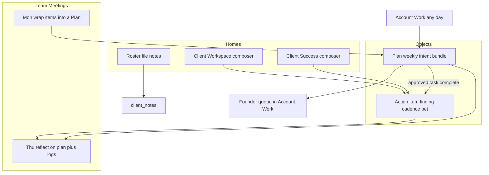
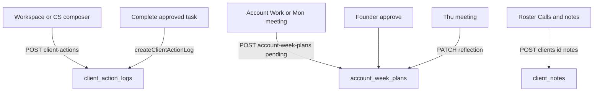

# Change Submission Hierarchy — Plans vs Action Items

## Purpose

Put the **change form** where operators already have a client selected,
and keep **plans** as the founder-attention object for weekly intent
and Thursday reflection.

Team meetings use plans to bring the week's work to the founder.
They are not the only place CS or a Media Buyer may log a change they
already have permission to make.

This spec owns **hierarchy and doors**. Work-type math (finding /
cadence / bet dates, baseline freeze, chart overlays) stays in the
[client work-log spec][work-log].

## Problem

Today there are three write surfaces and two objects, so intake feels
meeting-centric:

- Monday Team Meetings embed `AccountWeekPlanForm` with
  `origin_meeting_id`.
- Account Work hosts the same form with no meeting required.
- Client Success hosts `ClientActionLog`, which posts straight to
  `client_action_logs` with no founder gate.

The KPI Review SOP still reads as if meetings are the intake and the
founder approves every change. Completing a plan task already always
files a work-log row; ad-hoc logs already bypass the plan. The product
and the operating story disagree.

## Success criteria

- With a client selected in Client Workspace, CS or a Media Buyer can
  log a finding, cadence, or bet without opening a meeting or a plan.
- That save creates a `client_action_logs` row and **no** pending
  `account_week_plans` row.
- A plan can be created any day in Account Work, or in the Monday
  meeting (same object; meeting plans set `origin_meeting_id`).
- Founder approval applies to **plans only**.
- Thursday shows planned tasks plus that client's ad-hoc work-log
  rows for the week, and stores a short reflection on the plan.
- Vacation / LO-out / "team needs to know" stays on roster
  `client_notes`. It never becomes a `work_type` and never overlays
  the KPI graph.

## Non-goals

- A fourth `work_type` called note (or strategy / escalation)
- Putting the change composer on the roster client file
- Overlaying `client_notes` on KPI graphs, the work strip, or health
- Founder approval of ad-hoc action items
- Making meetings the only plan door, or the main change form
- Replacing week plans or reviving `meeting_commitments` as intake
- Changing finding / cadence / bet measurement rules from the
  work-log spec
- Client-facing share of this log

## Operating model

Two objects, two homes, one change composer.

### Plan

Intent **before** execution. The bundle that comes to the founder:
why this account, what we intend, who owns it, which day.

- Created in Account Work any day (`origin_meeting_id` null).
- Created in the Monday KPI meeting (same row,
  `origin_meeting_id` set).
- Status `pending` → founder `approved` or `rejected`.
- Thursday writes a **reflection** on this row. It is not a new
  object and not a work type.

Until the plan is approved, its tasks are intent only. Completing an
approved task writes the matching action-item row (existing complete
path in `POST /api/account-plan-tasks/[id]`).

### Action item

The change log. Same `client_action_logs` row whether it was born
inside a plan or filed on a random moment.

- **Finding** — after an audit or inspection. A problem was spotted.
  Not a change. Can later be promoted to a bet.
- **Cadence** — permission-level execution: kill an ad, extra
  follow-up, hygiene already in the seat.
- **Bet** — hypothesized KPI mover: new campaign, headline swap,
  new angle. Live date, baseline, review.

Ad-hoc items save immediately. No plan required. No founder step.

### Notes (not this composer)

Account context for the team: client on vacation, LO out, pause
request. Lives in existing `client_notes` on the roster client file
(Calls & notes: general / concern / win / internal). Different table,
different API, never on charts or health.

A finding is "we audited this and spotted a funnel problem." A note
is "the client is out next week." Do not collapse them.

## Surfaces

Four doors, each with one job.

### 1. Client Workspace — main change form

Primary door. When a client is selected in
`WorkspaceFilterBar`, show **Log work**. Opens the shared composer
(finding / cadence / bet) with `client_id` prefilled.

Disabled / hidden when scope is All clients or Live clients — there
is no single account to attach the log to. Operator must pick a
client first.

### 2. Client Success — same composer

The work log on the client health file uses the **same** composer
component as Workspace. Do not ship a second form. If the operator
is already diagnosing an account, they log there without bouncing
to Workspace.

### 3. Account Work — plan factory + founder queue

Unchanged job, clearer role:

- Create a Plan any day (Why + proposed action items → pending)
- Approve / reject
- This week's tasks, calendar, deployed review

Hub copy must stop implying that every *change* waits for the
founder, and stop saying complete-to-log is opt-in. Completing an
approved task always files the work-log row (work-log spec).

### 4. Team Meetings — wrap and reflect

- **Monday** (`mon-kpi-week-plan`): may still add a Plan in the room
  using the same Account Work form, tagged to that instance.
- **Thursday** (`thu-kpi-commitment-check`): review planned tasks
  vs what actually logged, including ad-hoc Workspace / CS rows for
  those clients. Save reflection on the plan.

Meetings are not the main change form.

### Roster client file — out of this system

Calls & notes only. No change composer. A text link to Workspace
**Log work** is optional later; v1 does not add it.

## Composer and plan fields

Same action-item fields whether filed ad-hoc or born as a plan
task. Type decides how heavy the form is.

### Action item

| Type | Required | Hidden / unused |
|------|----------|-----------------|
| Finding | Title, what we found, observed date | Hypothesis, KPI, review date, baseline |
| Cadence | Title, what we did, done date | Hypothesis, KPI, review, baseline |
| Bet | Title, what we changed, hypothesis, success metric. Live date only when it ships. Review date. | — |

Date mapping stays the work-log spec:

| Type | planned_date | change_date | review_date | baseline |
|------|--------------|-------------|-------------|----------|
| Finding | optional | observed | none | none |
| Cadence | optional (from plan task `scheduled_for` when born in a plan) | done / live | none | none |
| Bet (planned) | intend-to-ship | **null** | set | do not freeze |
| Bet (live) | kept | went live | yes | freeze 14d before live |

Ad-hoc findings and cadence stamp `change_date` on save (today in
the call-center timezone unless the operator overrides). Ad-hoc
bets that have not shipped stay `status = planned` with null
`change_date`.

### Plan

| Field | Role |
|-------|------|
| `why` | Why this account this week |
| `severity` | `911` / `below` / `watch` |
| `week_start` | Monday of the week |
| tasks | Proposed action items: type, title, owner, day, optional KPI on bets |
| `status` | `pending` until founder approve / reject |
| `origin_meeting_id` | Set only when created from a meeting |
| `reflection` | Thursday: what we learned; keep / kill / change next week. Null until then. |

`reflection` does not exist on `account_week_plans` today. Add a
nullable `text` column. Do not reuse `success_signal` or
`founder_note` (`founder_note` stays the reject / approve comment).

## Write paths

All action-item inserts still go through `createClientActionLog`
(work-log spec). Freeze baseline only when `work_type = bet`,
`change_date` is set, and status is not `planned`.

Ad-hoc POST must not insert `account_week_plans` or
`account_plan_tasks`.

## Permissions

| Action | Who | Gate today | Change |
|--------|-----|------------|--------|
| Log work | Anyone who can open that client in Client Workspace or Client Success. Media Buyer included via existing seat aliases. | `POST /api/client-actions` requires `client_health` only | Widen to `requireAnyPermission` of `client_workspace`, `client_health`, `media_buyer` (aliases already fold Team Command seats) |
| Create plan | Account Work, meetings, CS, CEO | `requirePlanAccess` | Unchanged |
| Approve plan | Owner or CEO | `userCanApprovePlans` | Unchanged |
| Write notes | Existing client-file notes path | `/api/clients/[id]/notes` | Unchanged |

No new capability permission key. Reuse view permissions.

Logging work does **not** require `account_work`. Creating a plan
does not require the operator to be in a meeting.

## Thursday reflection

Not a third object. For each plan in the Thursday list:

1. Show open vs done on that plan's tasks.
2. Show ad-hoc `client_action_logs` for the **same client** whose
   plot date (`change_date`, else `planned_date`, else `created_at`)
   falls in that plan's calendar week. Exclude rows already linked
   via `account_plan_tasks.client_action_log_id` so planned
   completions are not listed twice.
3. Save `reflection` on the plan (short text). Anyone with plan
   access may write it. Founder approval is not required.

Today `PATCH /api/account-week-plans/[id]` only edits
**pending** plans. Implementation must allow `reflection` on
pending or approved plans without opening the rest of the plan
for edit. Rejected plans stay closed.

Thursday does not create action items. If someone needs to log
mid-meeting, they use the Workspace / CS composer (ad-hoc).
Tasks can be added only while the plan is still **pending**
(existing "Only pending plans can be edited" rule). After
approval, new work is an ad-hoc log or a new plan.

## SOP copy that must change

[`kpi-review-meeting-sop.md`][kpi-sop] currently says:

- Capture work as account week plans; founder approves every plan.
- Optional: log a completed task as an account change.
- Tools: Account Work as new-plan home; meetings embed the form.

Rewrite on implementation to match this spec:

- Meetings wrap **plans** (Monday intent, Thursday reflection).
  They are not the only intake and not the main change form.
- Main change form: Client Workspace **Log work**, also Client
  Success composer.
- Founder approves **plans**, not every finding / cadence / bet.
- Completing an approved plan task **always** files the work-log
  row. No opt-in.
- Notes stay on the roster client file.

Do not rewrite the SOP in this pass; this spec is the source for
that later edit.

Account Work hub subtitle in `AccountWeekPlansHub` has the same
stale "opt in on complete" line. Update it with the implementation.

## Test contracts

- Ad-hoc save creates a work-log row and **no** pending plan.
- Plan from Account Work has `origin_meeting_id` null; plan from
  Monday has the meeting id.
- Finding / cadence skip baseline freeze; bet freezes only when
  live (`shouldFreezeBaseline` unchanged).
- Completing an approved task still files the matching work-log
  row and sets `client_action_log_id`.
- `POST /api/client-actions` succeeds for a user with
  `client_workspace` and without `client_health`.
- Notes created via `/api/clients/[id]/notes` do not appear in
  work-strip / KPI overlay queries (those stay on
  `client_action_logs` with `work_type` in finding / cadence / bet).
- Thursday ad-hoc feed excludes rows already linked from a plan
  task; includes an ad-hoc bet/cadence/finding in the same week.
- `PATCH` of `reflection` succeeds on an approved plan without
  allowing other fields to change.

## Relationship to the work-log spec

The [client work-log spec][work-log] remains source of truth for
types, dates, chart layers, and `createClientActionLog`.

This spec **overrides** that doc on hierarchy only:

- Week plans remain the weekly checklist, but they are no longer
  implied to be the main submission form.
- Ad-hoc logs from Workspace / CS are a first-class write path,
  not an accidental bypass.
- Notes are explicitly out of `client_action_logs`.

[work-log]: ./2026-08-18-client-work-log-design.md
[kpi-sop]: ../../../content/library/operations/people/kpi-review-meeting-sop.md
